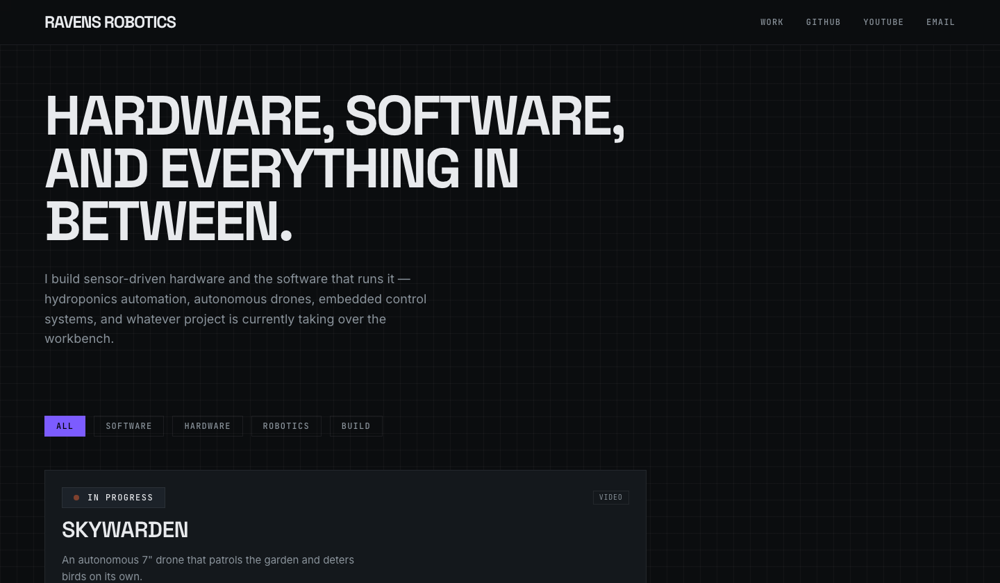

# Portfolio Site Template

A personal-portfolio template for people who build things: a clinical,
technical visual language for robotics/hardware/software projects, a
content schema that actually fits how those projects differ from each
other (a gallery for a physical build, a video for a drone flight, a
downloads section for a BOM), and a local-only editor so you never have to
hand-write frontmatter YAML if you don't want to.



## Features

- **Astro 7 + Tailwind CSS 4**, static output — no server to run, no
  database, deploys as plain files.
- **A real content schema**, not a loose collection of Markdown files:
  status/category enums the build enforces, a gallery type with required
  per-image alt text, a discriminated union for video (YouTube / Vimeo /
  local file), authored file sizes for downloads. Get a field wrong and the
  build tells you exactly what's valid instead of silently doing the wrong
  thing.
- **A local content editor** (`/studio` in dev only — see below) generated
  from that same schema, so the editor's dropdowns and the build's
  validation can never drift apart. Drag-and-drop image uploads with
  automatic resizing, live validation, orphaned-file detection.
- **The studio never ships.** It's not gated behind a login or hidden by
  a redirect — the route structurally doesn't exist in a production build.
  Verified by grepping the built output for studio-only strings; see
  AGENTS.md if you're curious how.
- **Real performance/accessibility defaults**: responsive AVIF/WebP images
  throughout, lazy-loaded everything below the fold, keyboard-navigable
  galleries and dropdowns, `prefers-reduced-motion` respected everywhere
  including hover-preview video, WCAG AA contrast. Lighthouse 95+ on all
  four axes out of the box.
- **SEO that's actually wired up**: per-project Open Graph images (your
  cover photo, auto-cropped), JSON-LD structured data, a sitemap that
  excludes the dev-only/reference pages, `robots.txt`.
- **A two-tier media policy** that keeps the git repo small: small images
  colocated with their content, short video clips self-hosted, everything
  else on GitHub Releases — enforced by a pre-commit hook, not just a
  suggestion in a doc. See CONTENT.md.

## Quickstart

This repo's `main` branch is a real, working site — `site.config.ts` and
`src/content/projects/` are committed, real files, not placeholders you
need to generate. That's deliberate: a fresh clone has to build and deploy
correctly with zero setup, because that's also how *this* site deploys.
Forking it means replacing that real content with your own.

1. **Fork this repo** on GitHub (the button in the top right), then clone
   your fork and install:
   ```
   git clone https://github.com/<you>/<your-fork>.git
   cd <your-fork>
   npm install
   ```
2. **Edit `site.config.ts`** with your own name, bio, and links.
   `site.config.example.ts` documents every field if you want the reference,
   but the file you actually edit is `site.config.ts` itself.
3. **Delete the example projects.** This is the one step that's easy to
   forget — if you skip it, someone else's projects publish on your site:
   ```
   rm -rf src/content/projects/avian-visitors src/content/projects/lyric-panel \
          src/content/projects/pid-controller src/content/projects/skywarden \
          src/content/projects/terrapod public/videos/terrapod
   ```
   (Keep one of them around a little longer if you want a working reference
   while you learn the schema — TERRAPOD shows a raster cover + gallery +
   video, PID CONTROLLER shows the bare text-only card. Just don't ship them.)
4. **Add your own projects** — run `npm run dev` and use `/studio`, or (if
   you're using Claude Code) the `/new-project` command, or hand-write
   `index.mdx` files. See CONTENT.md for the schema and a full walkthrough.
5. **Regenerate the social-share image** from your new name/tagline:
   ```
   node scripts/generate-og-default.mjs
   ```
6. **Deploy:**

   [](https://deploy.workers.cloudflare.com/?url=https://github.com/your-handle/your-repo-name)

   *(replace `your-handle/your-repo-name` in that link with your actual
   fork before this button will work — GitHub doesn't let a README know
   its own repo URL)*. Or connect the repo manually in the Cloudflare Pages
   dashboard: build command `npm run build`, output directory `dist`.

## Local development

```
npm run dev            # dev server at localhost:4321, includes /studio
npm run build           # production build to dist/ — /studio is not in it
npm run preview          # serve the production build locally
npm run setup            # regenerate the OG image + print a fork checklist — optional, never destructive
npm run check            # astro check — type errors
npm run check:videos      # warns about oversized/missing-WebM-sibling video assets
npm run check:links       # broken internal links, run against dist/ after a build
npm run check:cms-config  # fails if public/admin/config.yml drifted from the schema
```

## Troubleshooting

**My deployed site still shows someone else's projects/name.** You skipped
Quickstart step 3 (delete the example projects) or step 2 (edit
`site.config.ts`) — both are real committed content, not placeholders, so
the build has no way to know you meant to replace them.

**`npm run build`/`npm run dev` prints "The collection 'projects' does not
exist or is empty."** Expected and harmless if you're between Quickstart
steps 3 and 4 — you deleted the example projects and haven't added your own
yet. The build still succeeds; the homepage just has an empty grid until
you add at least one project.

**I edited `site.config.ts` but the social-share image still shows the old
name.** `public/og-default.png` is a generated file, not computed at
request time — re-run `node scripts/generate-og-default.mjs` (or
`npm run setup`, which does the same thing plus a couple of sanity checks)
after any change to `name`/`tagline` in `site.config.ts`.

**My pre-commit hook rejected a file.** That's the media-size policy
working as intended — see CONTENT.md's "Media policy" section for what to
do instead of force-committing it.

**`git push` is rejected / husky isn't running.** Run `npm install` again —
the pre-commit hook installs via the `prepare` script, which only fires on
`npm install`, not on every command.

**I want to see the design tokens.** `/styleguide`, in dev or in your
deployed site (it's a real page, just excluded from the sitemap).

## Optional: editing from a browser (Sveltia CMS)

**Skip this whole section if you're forking the repo and don't want it** —
delete `public/admin/` and nothing else changes. Everything else in this
README, CONTENT.md, and the `/studio` editor works exactly the same with or
without it.

[Sveltia CMS](https://github.com/sveltia/sveltia-cms) is a git-backed editor
that runs entirely as static files at `/admin` and talks to GitHub's API
directly from your browser — no server of ours, no database, nothing to
host or keep patched beyond the two files in `public/admin/`. The appeal
over `/studio`: it works from any browser, on any machine, without cloning
the repo — a phone in a pinch.

`public/admin/config.yml` is a **generated file** —
`scripts/generate-cms-config.mjs` produces it from
`scripts/cms-config-template.mjs`, which imports its enum options and
numeric limits (statuses, categories, card sizes, video providers, the
summary/tags limits) directly from `src/project-schema.ts`, the same file
`src/content.config.ts` and `/studio` build on. `npm run build` regenerates
it automatically, and `npm run check:cms-config` (run in CI on every PR)
fails if the committed file doesn't match what the template would produce,
or if its field list disagrees with the schema's actual fields — so this
can drift exactly as little as `/studio` can. **Never hand-edit
`public/admin/config.yml`** — the header comment says so too, and the next
build or CI run will just tell you it's wrong. Change
`scripts/cms-config-template.mjs` instead, then run
`node scripts/generate-cms-config.mjs`.

The one thing genuinely not derived from the schema — because it has
nothing to do with it — is which GitHub repo the CMS commits to.

### Setup

1. **If you forked this repo**, edit the `REPO` constant near the top of
   `scripts/cms-config-template.mjs` — it currently points at
   `Zacccyyy/RavensRoboticsPortfolioPage`. This is a real, committed value
   like everything else in this template's Quickstart, not a placeholder;
   change it to `<your-username>/<your-repo>`, then run
   `node scripts/generate-cms-config.mjs` (or just `npm run build`) to
   regenerate `config.yml` from it. Skipping this doesn't leak anything —
   GitHub won't issue you a token scoped to a repo you don't own — it just
   won't work until you fix it.
2. **Generate a fine-grained personal access token**: go to
   `github.com/settings/personal-access-tokens/new`, give it a name,
   restrict **Repository access** to only this one repo, and under
   **Permissions → Repository permissions**, set **Contents** to
   **Read and write**. Nothing else needs a permission. Generate it and
   copy the token — GitHub only shows it once.
3. Visit `https://<your-site>/admin/`, click **Sign In Using Access
   Token**, and paste it in. (There's also a **Sign In with GitHub**
   button — that's the OAuth path, which needs a separate proxy server we
   deliberately didn't set up; use the token option.)
4. You're in. Every save commits directly to `main` — there's no draft
   step (`publish_mode: simple` in `config.yml`), matching how `/studio`
   already works.

The token lives only in your browser (`localStorage`) and is sent only to
`api.github.com` — Sveltia CMS has no backend of its own to send it to.
Treat it like a password: it grants write access to this repo for as long
as it's valid. Revoke it anytime from the same GitHub settings page.

### Should you also put Cloudflare Access in front of `/admin`?

Access (part of Cloudflare Zero Trust) can require its own login — email
code, GitHub OAuth, whatever identity provider you connect — before a
browser can load `/admin` *at all*, on top of the GitHub token check above.
Free for up to 50 authenticated users on Cloudflare's Zero Trust free
plan.

**What it actually adds**, precisely: right now, `/admin` is publicly
loadable by design — it's a login form, and GitHub's own permission check
is what actually gates every write. Nobody can commit anything without a
valid token scoped to this repo, whether or not the page is public. Adding
Access doesn't strengthen that check at all; the two systems don't talk to
each other. What it *does* close is a different, smaller risk: **anyone
being able to load the page in the first place.** If Sveltia CMS's own
code, or the unpkg CDN serving it, were ever compromised, a malicious
version could run in the browser of *any* visitor who happens to open
`/admin` — Access would mean only people who've already passed a second,
independent login could ever reach that code at all.

**For a solo maintainer on a public repo, I'd add it** — specifically
because the cost is close to zero (a few minutes, free at this scale) for
closing a real, if low-probability, class of risk (a compromised CMS
bundle) that GitHub permissions alone genuinely cannot touch. It's not
solving your main exposure — that's still entirely about who holds a valid
token, which Access doesn't affect — so don't mistake it for a substitute
for treating the token carefully. If you'd rather not manage a second
login for your own single-user site, skipping it isn't a reckless choice
either; you're relying on the same trust in Sveltia's supply chain that
you're already extending to every other npm package this project uses.

## License

The template code (everything except your own content once you add it) is
MIT-licensed — see LICENSE. That covers the Astro components, the studio
editor, the build tooling; it says nothing about whatever you personally
publish through it, which is yours.

## Contributing

Fixing a bug in the template itself, or improving these docs? See
CONTRIBUTING.md. Most people who use this repo should fork it, not open a
PR against it — see the Quickstart above.
